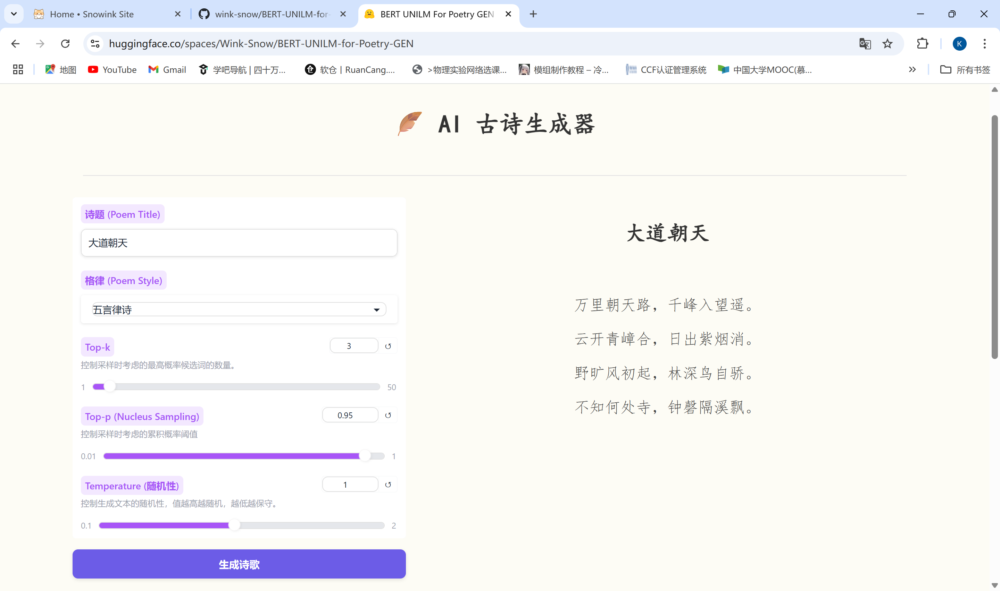

# BERT-UNILM-for-Poetry-Gen

This is a Poetry Generation project based on BERT-UNILM. We use the `chinese-bert-wwm` as pre-trained model. You could get it from [here](https://huggingface.co/hfl/chinese-bert-wwm/tree/main).

Our model has been published in [Huggingface Model Hub](https://huggingface.co/Wink-Snow/BERT-UNILM-for-Poetry-GEN).
Welcome to star this repo if you like it! :star:

## :sparkles: Display
Due to the limitation of cpu(2G), the generation speed is relatively slow. It is not perfect, we will continue to optimize it in the future. :smile:
[Demo in Huggingface Spaces](https://huggingface.co/spaces/Wink-Snow/BERT-UNILM-for-Poetry-GEN)



## :rocket: Environment

- Pytorch
- Datasets: [chinese-poetry](https://github.com/Werneror/Poetry)

## :fire: Feature

- [x] Generate Chinese poems with different styles
- [x] Strength the `beam_search` method
- [x] Backend api built by `fastapi`
- [x] Frontend app built by `gradio`
  
## :hammer: Structure
```bash
├─data
│  ├─processed
│  └─raw
├─pretrained_weights
│  └─bert_chinese_wwm
├─scripts                   # Scripts for processing data
|  └─process_data.py
├─test                      # Test data dir when debugging
│  └─data
├─utils                     # Utils for training and testing
│  └─auto_poem.py
|  └─const.py
|  └─load_data.py
├─cipai.txt
├─task_seq2seq_auto_poem.py # Main script for training
├─test_seq2seq.py           # Main script for testing
├─poem_master.py
├─main_api.py               # Main script for api
├─gradio_app.py             # Main script for gradio app
├─requirements.txt
└─README_en.md
```

## :wrench: Usage

### Data Processing

- Download the raw data from [chinese-poetry](https://github.com/Werneror/Poetry).
- Run `scripts/process_data.py` to process the raw data and save the processed data to `data/processed`.

### Training

Run `task_seq2seq_auto_poem.py` to train the model.

### Testing

Run `test_seq2seq.py` to test the model.

### API(Optional, nessessary if you want to deploy it to the web)

Run `main_api.py` to start the api. You could access the api at `http://HOST:PORT/docs`.

### Gradio App

Run `gradio_app.py` to start the gradio app. 

## :memo: Reference

- [从语言模型到Seq2Seq：Transformer如戏，全靠Mask](https://kexue.fm/archives/6933)
- [bert4torch/seq2seq](https://github.com/Tongjilibo/bert4torch/blob/master/examples/seq2seq/task_seq2seq_autotitle.py)